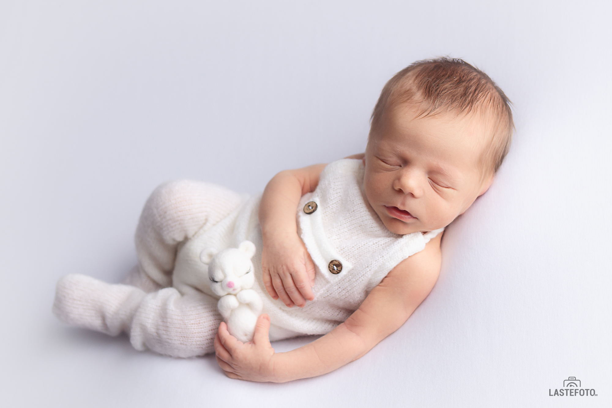
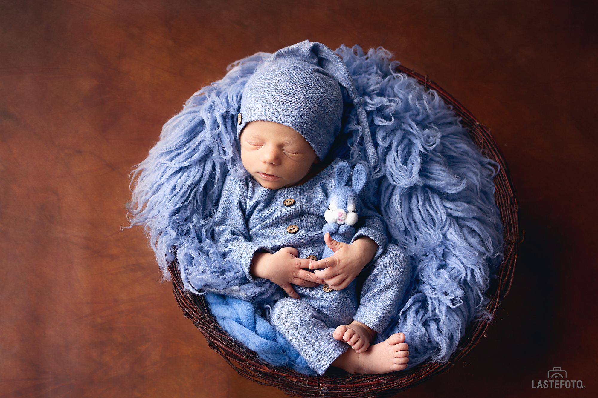
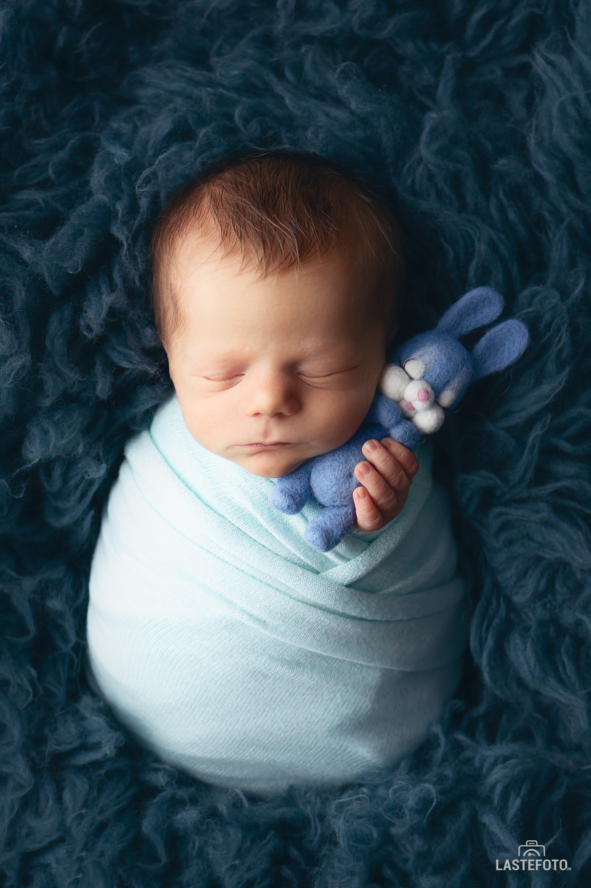

## My baby is so small, maybe we should postpone the photo session and wait until he grows up a little and gets stronger?

Not really better, because by refusing to take a photo of a newborn, you are missing the opportunity to capture the important moments of your baby's first days, which are truly worthy of your family photo album. The newborn looks so touching and tender right now. In a few months he/she will be completely different.

 

## How to take a photo of a newborn if he only eats and sleeps?

Long and deep sleep is a real gift for a newborn photographer. With a sleeping baby, we can bring to life all photo ideas. But what to do when the baby is awake? In my practice, there were no babies who were awake throughout the entire newborn photosession. Although I always recommend setting aside enough time for photosession - about 2-3 hours and not planning important things (for example, going to the doctor) for the afternoon.

## Are poses safe for the baby?

Yes, the poses taken by an experienced newborn photographer are safe for the baby. They do not cause him any inconvenience - the baby continues to sleep peacefully and sweetly. When choosing a newborn photographer, make sure that he has the necessary qualifications. To do this, you can ask the photographer or see on the website what training courses he took in newborn photography.

## Newborn photoshoot usually takes place in the studio. Is it clean enough?

Yes, in photo studios intended for newborn photosessions, they monitor the cleanliness. Everything you need for shooting is in the studio. Here, a comfortable temperature for the baby is maintained, the props are regularly processed with products safe for newborns.

Enjoy the first photosession in your baby's life, because every moment is worth capturing! ❤️

