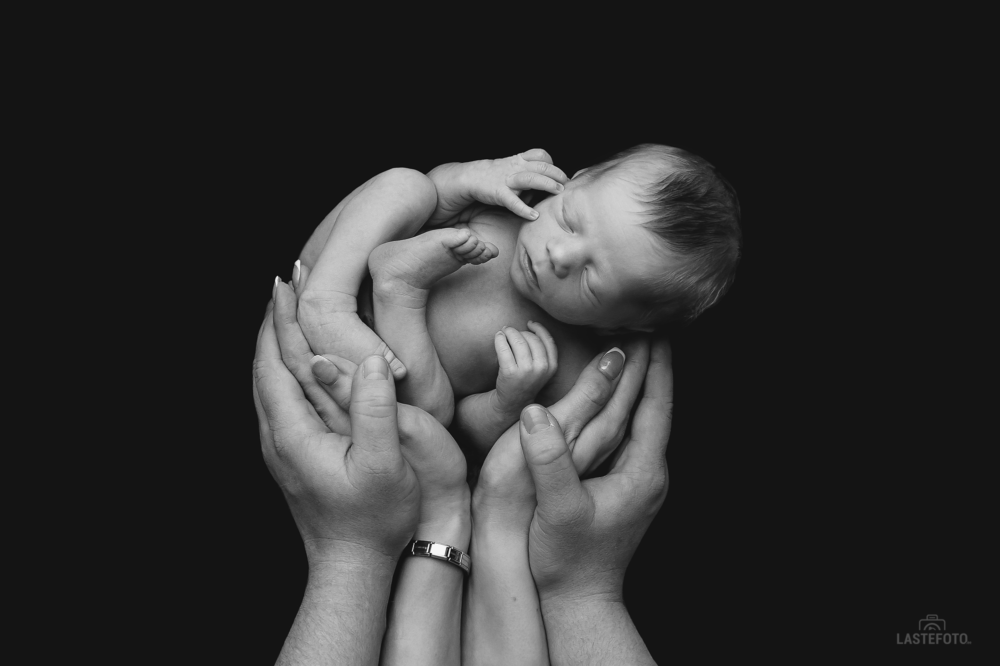

## Мой малыш такой маленький, может, стоит отложить фотосессию и подождать пока он немного подрастёт и окрепнет?

На самом деле не лучше, потому что, отказываясь от фотосъёмки новорождённого, вы упускаете возможность запечатлеть важные моменты первых дней жизни своего малыша, которые действительно достойны вашего семейного фотоальбома.  Новорождённый выглядит так трогательно и нежно именно сейчас. Через несколько месяцев он будет уже совсем другим.

 

## Как фотографировать новорожденного, если он только ест и спит?

Продолжительный и глубокий сон - настоящий подарок для фотографа. Со спящим младенцем мы можем воплотить в жизнь все фото идеи и задумки. Но что делать, когда малыш не спит? В моей практике не было младенцев, которые бодрствовали на протяжении всей фотосессии. Хотя я всегда рекомендую выделять достаточно времени для фотосъемки - около 2-3 часов и не планировать важные дела (например, поход к врачу) на вторую половину дня.

## А позы безопасны для малыша?

Да, позы, которые делает опытный фотограф новорожденных, безопасны для малыша. Они не доставляют ему неудобств - малыш продолжает спокойно и сладко спать. Выбирая фотографа, убедитесь, что он обладает необходимой квалификацией. Для этого вы можете спросить у фотографа или посмотреть на сайте, какие курсы обучения фотографии новорожденных он проходил.

## Фотосессия новорожденных обычно проходит в студии. Там достаточно чисто?

Да, в фотостудиях, предназначенных для фотосессии новорожденных, следят за чистотой. Все необходимое для съемки есть в студии. Здесь поддерживается комфортная для малыша температура, реквизит регулярно обрабатывается безопасными для новорожденных средствами. 

Наслаждайтесь первой фотосессией в жизни вашего крохи, ведь каждый миг стоит того, чтобы его запечатлеть! ❤️

